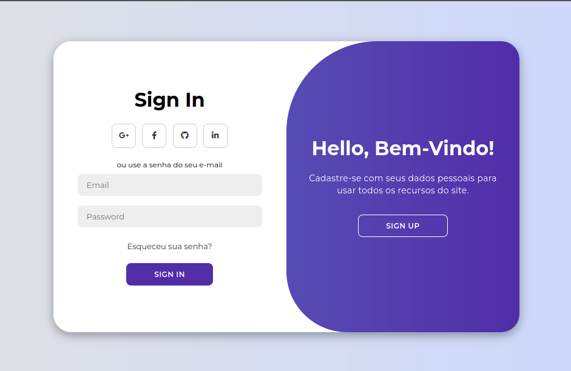

# 🔐 Login & Register UI — Estudo de Front-end / Front-end Study

Este projeto é uma **interface de login e cadastro** desenvolvida com **HTML, CSS e JavaScript modernos**, focado em **prática de front-end**, animações e layout responsivo.  
This project is a **login and register interface** built with **modern HTML, CSS, and JavaScript**, focused on **front-end practice**, animations, and responsive layout.

O objetivo principal é **aprimorar habilidades** em:  
The main goal is to **improve skills** in:  
- Estruturação semântica com HTML / Semantic structuring with HTML  
- Layout com CSS Flexbox / Layout with CSS Flexbox  
- Animações com CSS Transitions e Keyframes / Animations with CSS Transitions and Keyframes  
- Interações dinâmicas com JavaScript / Dynamic interactions with JavaScript  

---

## 🚀 Preview do Projeto / Project Preview

A interface inclui: / The interface includes:  
- Tela de **Login** e **Cadastro** / **Login** and **Register** screens  
- **Animações suaves** na troca entre formulários / Smooth animations when switching forms  
- Layout moderno e organizado / Modern and clean layout  
- Experiência visual focada em UI/UX / UI/UX-focused visual experience  



---

## 🛠️ Tecnologias Utilizadas / Technologies Used

- **HTML5** — Estrutura da página / Page structure  
- **CSS3** — Estilização, Flexbox, Transitions e Keyframes / Styling, Flexbox, Transitions, and Keyframes  
- **JavaScript** — Controle de interações e animações / Interaction and animation control  
- **Flexbox** — Organização do layout responsivo / Responsive layout organization  

---

## ✅ Funcionalidades / Features

- Troca entre **telas de login e cadastro** com animação suave / Switch between **login and register screens** with smooth animation  
- Validação básica de formulário / Basic form validation  
- Layout **responsivo e organizado** / Responsive and clean layout  
- Código separado por pastas de **CSS e JS** / Code separated into **CSS and JS folders**  

---

## 🎯 Objetivo do Projeto / Project Goal

Este projeto foi criado para **aprendizado prático de front-end**, com foco em:  
This project was created for **practical front-end learning**, focusing on:  
- Melhorar o domínio de **CSS para layouts e animações** / Improve CSS skills for layouts and animations  
- Praticar **manipulação do DOM com JavaScript** / Practice DOM manipulation with JavaScript  
- Entender a **estrutura de uma interface moderna de autenticação** / Understand the structure of a modern authentication interface  
- Treinar **organização de código e separação de responsabilidades** / Train code organization and separation of concerns  

---

## 📚 Sobre o Estudo / About the Study

O desenvolvimento foi inspirado em um **tutorial em vídeo**, mas:  
Development was inspired by a **video tutorial**, but:  
- O código foi **reorganizado** / Code was **restructured**  
- A estrutura foi **adaptada para estudo** / Structure was **adapted for learning**  
- O projeto é um **exercício prático de aprendizado** / Project is a **practical learning exercise**  

Este repositório **não tem fins comerciais** e faz parte do meu processo de evolução como desenvolvedor front-end.  
This repository **is not for commercial purposes** and is part of my growth as a front-end developer.

---

## 📂 Estrutura do Projeto / Project Structure

```bash
/
├── index.html
├── css/
│   └── style.css
├── js/
│   └── script.js
└── README.md
